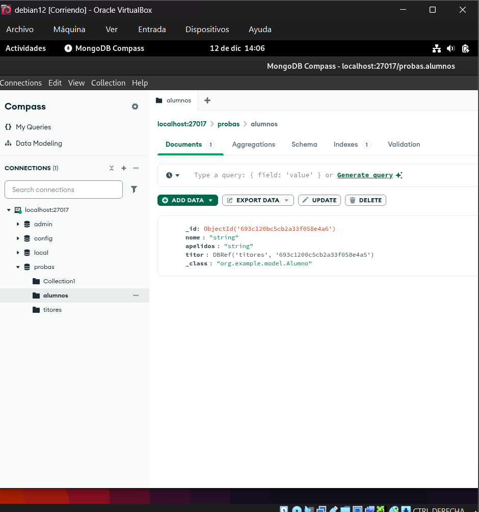
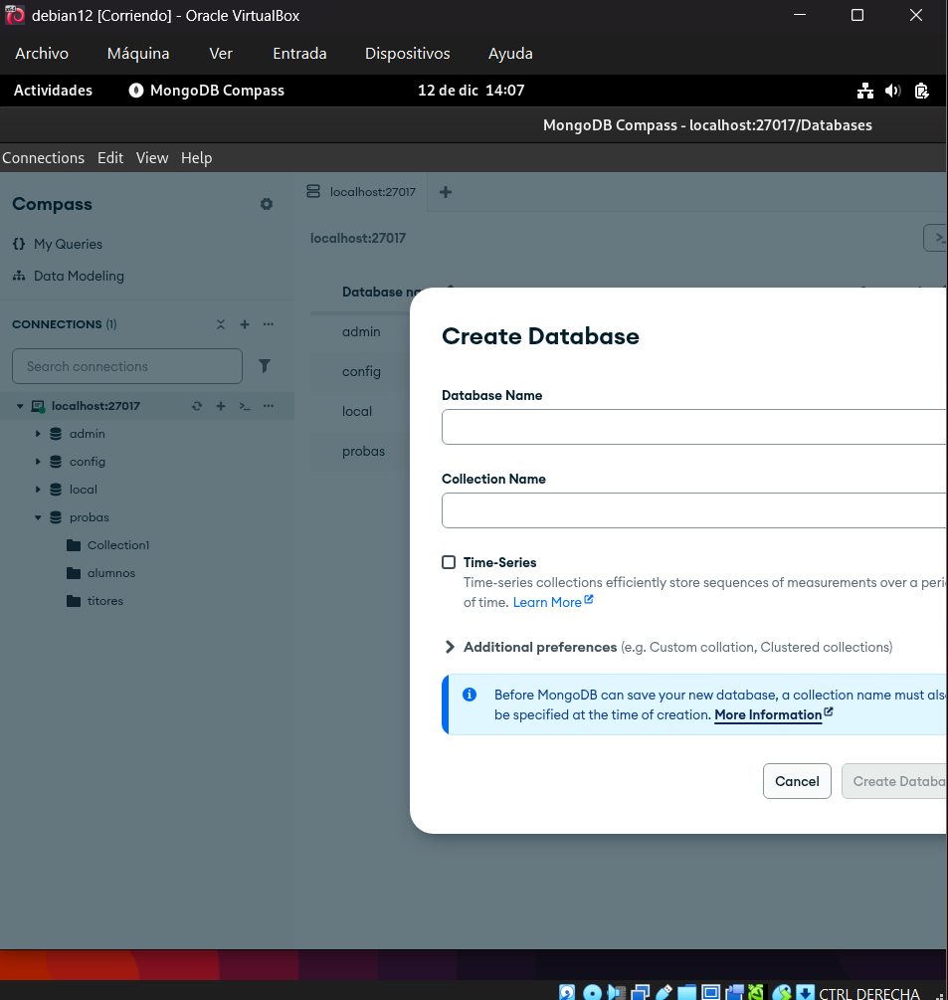
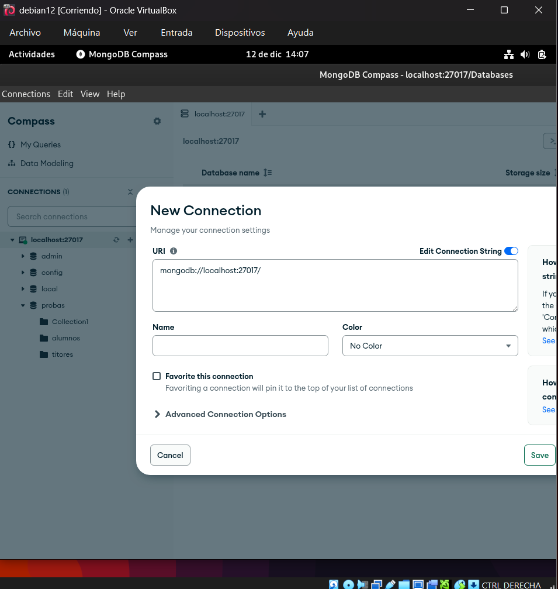

# 🧬 Microservicio de Gestión de Adestradores y Pokémon (MongoDB con Referencias)

Este microservicio proporciona una API RESTful para gestionar **adestradores** y sus **Pokémon**, utilizando **MongoDB** con relaciones mediante **referencias (`@DBRef`)**.  
Implementa una relación **one-to-many** (un adestrador puede tener **múltiples Pokémon** asociados), y está construido con **Spring Boot**, **Spring Data MongoDB** y **Swagger** para documentación interactiva.

---

## ✅ Funcionalidades

La API permite:

- ✅ Crear adestradores
- ✅ Crear Pokémon (asociados a un adestrador mediante su `id_adestrador`)
- ✅ Listar todos los adestradores
- ✅ Listar todos los Pokémon
- ✅ Obtener un adestrador o Pokémon por su ID
- ✅ Actualizar adestradores y Pokémon
- ✅ Eliminar adestradores y Pokémon

> ⚠️ **Importante**: Al crear o actualizar un Pokémon, debes proporcionar el campo `"id_adestrador"` con el **ID válido** de un adestrador existente.  
> ❌ Si el ID no existe, se devuelve error **400** o **404**.

> ✅ Todos los endpoints devuelven respuestas en formato **JSON**.  
> ✅ Los errores devuelven códigos HTTP adecuados: `400` (solicitud incorrecta), `404` (no encontrado), `204` (eliminado), etc.

---

## 📦 Modelo de Datos

### Colección `adestrador`

```json
{
  "_id": "66a1b2c3d4e5f67890123456",
  "nome": "Brock",
  "cidade": "Ciudad Plateada"
}
```

### Colección `pokemon`

```json
{
  "_id": "66a1b2c3d4e5f67890123457",
  "nome": "Geodude",
  "tipo": ["Roca", "Tierra"],
  "nivel": 28,
  "habilidades": ["Arañazo", "Derribo"],
  "adestrador": {
    "$ref": "adestrador",
    "$id": { "$oid": "66a1b2c3d4e5f67890123456" }
  }
}
```

> 🔗 **Relación mediante referencia**: Cada documento `pokemon` contiene una referencia (`@DBRef`) al documento `adestrador`.  
> 🔄 **Transparencia en JSON**: Al serializar, el campo `"id_adestrador"` muestra el ID del adestrador (gracias a `@JsonProperty`), evitando bucles o datos innecesarios.

---

## 🌐 Endpoints de la API

Todos los endpoints están bajo la ruta base: `/api`

### Adestradores

| Método   | Ruta                     | Descripción                          |
|----------|--------------------------|--------------------------------------|
| `POST`   | `/api/adestrador`        | Crear un nuevo adestrador            |
| `GET`    | `/api/adestrador`        | Listar todos los adestradores        |
| `GET`    | `/api/adestrador/{id}`   | Obtener un adestrador por ID         |
| `PUT`    | `/api/adestrador/{id}`   | Actualizar un adestrador             |
| `DELETE` | `/api/adestrador/{id}`   | Eliminar un adestrador               |

### Pokémon

| Método   | Ruta                   | Descripción                        |
|----------|------------------------|------------------------------------|
| `POST`   | `/api/pokemon`         | Crear un nuevo Pokémon (con `id_adestrador`) |
| `GET`    | `/api/pokemon`         | Listar todos los Pokémon           |
| `GET`    | `/api/pokemon/{id}`    | Obtener un Pokémon por ID          |
| `PUT`    | `/api/pokemon/{id}`    | Actualizar un Pokémon              |
| `DELETE` | `/api/pokemon/{id}`    | Eliminar un Pokémon                |

---

## 🧪 Ejemplo de uso

### Crear un Pokémon asociado a un adestrador

**POST** `/api/pokemon`

```json
{
  "nome": "Pikachu",
  "tipo": ["Eléctrico"],
  "nivel": 42,
  "habilidades": ["Impactrueno", "Rapidez"],
  "id_adestrador": "66a1b2c3d4e5f67890123456"
}
```

> ⚠️ El `id_adestrador` debe corresponder a un adestrador existente. Si no, se retorna error.

---

## 📚 Documentación API (Swagger)

La API incluye documentación interactiva mediante **Swagger UI**:

🔗 [http://localhost:8080/swagger-ui/index.html](http://localhost:8080/swagger-ui/index.html)

También puedes acceder a la especificación OpenAPI en:

```
GET /v3/api-docs
```

> 💡 **Consejo**: Usa Swagger UI para probar los endpoints directamente desde el navegador, sin necesidad de Postman.

---

## ⚙️ Configuración

El servicio corre en el puerto **8080** (configurable en `application.properties`):

```properties
app.version=1.0.0
server.port=8080
spring.application.name=Gestor Alumnos Mongo VM

spring.data.mongodb.uri=mongodb://10.0.12.52:27017/probas

springdoc.swagger-ui.path=/swagger-ui/index.html
```

> La base de datos utilizada es `probas`, y las colecciones se crean automáticamente.

---

## 🛠️ Tecnologías utilizadas

- **Lenguaje**: Java 17+
- **Framework**: Spring Boot
- **Base de datos**: MongoDB (con `@DBRef` para relaciones)
- **Persistencia**: Spring Data MongoDB
- **Validación**: Manejo de excepciones (`EntityNotFoundException`, `IllegalArgumentException`)
- **Documentación**: Swagger/OpenAPI 3 (`springdoc-openapi`)
- **Arquitectura**: Capas de controlador, servicio y repositorio

---

## ▶️ Servidor disponible en

```
http://localhost:8080
```
### 📊 Capturas de pantalla


---



---



---



---

---

> 💡 **Nota final**: Este diseño permite una **relación eficiente y escalable** entre adestradores y Pokémon, ideal para futuras expansiones (como listar todos los Pokémon de un adestrador en un solo endpoint, si se implementa).

```dotenv
    http://localhost:8080/swagger-ui/swagger-ui/index.html#/
```


