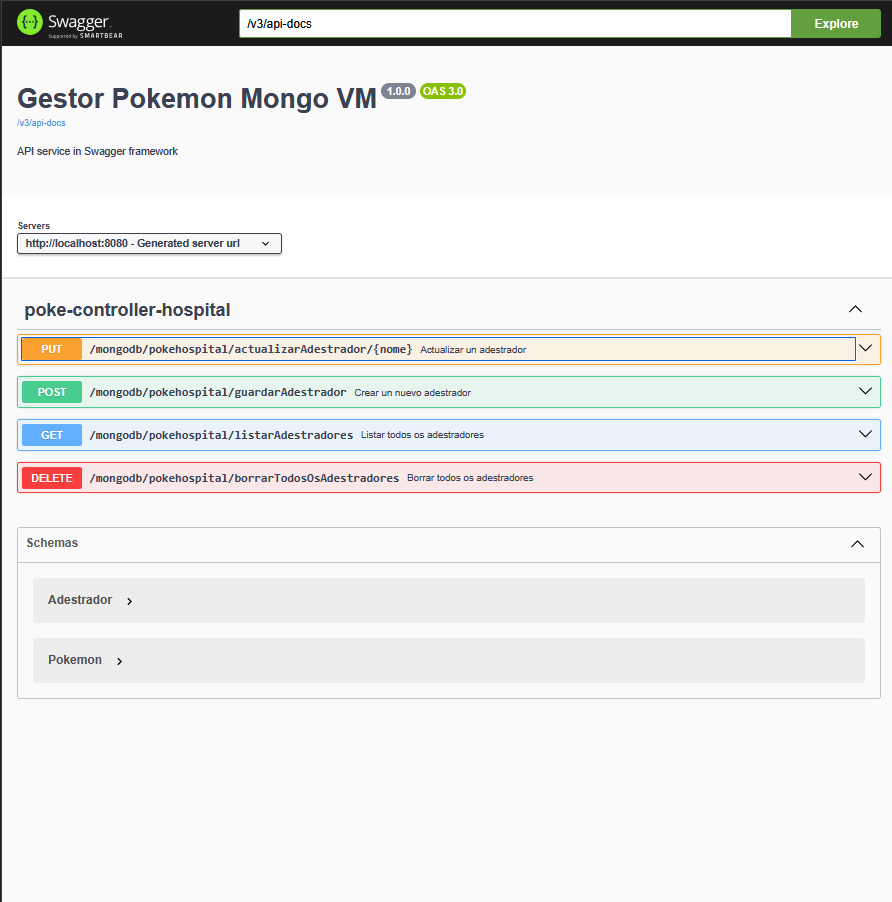

Claro. A continuación, te presento un **README.md** limpio, bien estructurado y en formato **Markdown estándar** (sin el formato RTF que enviaste), siguiendo la misma estructura y estilo del ejemplo proporcionado, pero adaptado a tus archivos y funcionalidad real (uso de **MongoDB**, modelo **Adestrador-Pokemon**, endpoints disponibles, etc.).

---

```markdown
# 🏥 Microservicio de Gestión de Adestradores y Pokémon (MongoDB)

Este microservicio proporciona una API RESTful para gestionar **adestradores** y sus **Pokémon**, utilizando una base de datos **MongoDB**. Cada adestrador puede tener **un único Pokémon asociado** (relación **one-to-one**), y está implementado con **Spring Boot** y **Spring Data MongoDB**.

---

## ✅ Funcionalidades

La API permite:

- ✅ Crear un nuevo adestrador (con su Pokémon asociado)
- ✅ Listar todos los adestradores (incluyendo sus Pokémon)
- ✅ Actualizar un adestrador por su nombre
- ✅ Eliminar todos los adestradores
- ❌ **No se permite eliminar un adestrador individual por nombre** (aunque el repositorio lo soporta, no hay endpoint en el controlador)

> Todos los endpoints devuelven respuestas en formato **JSON**.  
> Los errores devuelven códigos HTTP adecuados (400, 404, 500, etc.).

---

## 📦 Modelo de Datos

### Colección `adestrador`

Cada documento tiene la siguiente estructura:

```json
{
  "_id": "ObjectId(...)",
  "nome": "Ash",
  "cidade": "Pueblo Paleta",
  "pokemon": {
    "id_pokemon": "ObjectId(...)",
    "nome": "Pikachu",
    "tipo": ["Eléctrico"],
    "nivel": 85,
    "habilidades": ["Impactrueno", "Agilidad"]
  }
}
```

> Nota: Se usa una **relación embebida** (el Pokémon está dentro del documento del adestrador).

---

## 🧪 Endpoints de la API

| Método   | Ruta                                      | Descripción                               |
|----------|-------------------------------------------|-------------------------------------------|
| `POST`   | `/mongodb/pokehospital/guardarAdestrador` | Crear un nuevo adestrador                 |
| `GET`    | `/mongodb/pokehospital/listarAdestradores`| Listar todos los adestradores             |
| `PUT`    | `/mongodb/pokehospital/actualizarAdestrador/{nome}` | Actualizar un adestrador por nombre |
| `DELETE` | `/mongodb/pokehospital/borrarTodosOsAdestradores` | Eliminar todos los adestradores      |

---

## 🧭 Ejemplo de uso

### Crear un adestrador

**POST** `/mongodb/pokehospital/guardarAdestrador`

```json
{
  "nome": "Misty",
  "cidade": "Ciudad Celeste",
  "pokemon": {
    "nome": "Starmie",
    "tipo": ["Agua", "Psíquico"],
    "nivel": 45,
    "habilidades": ["Hidrobomba", "Psicorrayo"]
  }
}
```

---

## 📚 Documentación API (Swagger)

La API incluye documentación interactiva mediante **Swagger UI** en:

```
GET /swagger-ui/index.html
```

Accede directamente desde tu navegador:

🔗 [http://localhost:8080/swagger-ui/index.html](http://localhost:8080/swagger-ui/index.html)

> Asegúrate de que la aplicación esté corriendo en `localhost:8080` (puerto configurado en `application.properties`).

---

## 🛠️ Configuración

Archivo `application.properties`:

```properties
app.version=1.0.0
server.port=8080
spring.application.name=Gestor Pokemon Mongo VM
spring.data.mongodb.uri=mongodb://10.0.12.52/probas
springdoc.swagger-ui.path=/swagger-ui/index.html
springdoc.api-docs.enabled=true
springdoc.swagger-ui.enabled=true
```

> La base de datos MongoDB está alojada en `10.0.12.52`, base de datos `probas`.

---

## 🧰 Tecnologías utilizadas

- **Lenguaje**: Java 17+
- **Framework**: Spring Boot
- **Base de datos**: MongoDB
- **ORM**: Spring Data MongoDB
- **Documentación**: Swagger/OpenAPI 3 (con `springdoc-openapi`)
- **Patrón**: RESTful API con controladores, servicios y repositorios

---

## ▶️ Servidor disponible en

```
http://localhost:8080
```

## Mongo db compass

---

### 📊 Capturas de pantalla


---


---


---


---

> 💡 **Consejo**: Usa Swagger UI para probar los endpoints sin necesidad de herramientas externas como Postman.

```dotenv
    http://localhost:8080/swagger-ui/swagger-ui/index.html#/
```



---
