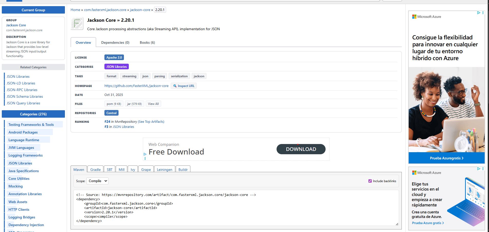

---

# 🛒 Microservicio de Gestión de Listas de Compra (MongoDB + Jackson JSON)

Este microservicio proporciona una solución robusta para la ingesta, persistencia y gestión de listas de compra. Permite leer archivos JSON locales estructurados por categorías (Groceries, Personal Care, Household Items) y almacenarlos en una base de datos **MongoDB**.

El proyecto sigue una arquitectura limpia de **Controller-Service-Repository** y utiliza **Jackson** para el mapeo avanzado de archivos planos a objetos Java.

---

## ✅ Funcionalidades

La API permite:

* ✅ **Importación Masiva**: Lectura de archivos `.json` locales mediante rutas de sistema.
* ✅ **Persistencia Automática**: Guardado de listas procesadas en colecciones de MongoDB.
* ✅ **Gestión Categorizada**: Clasificación automática de ítems en `groceries`, `personal_care` y `household_items`.
* ✅ **Documentación Interactiva**: Acceso total a los endpoints vía Swagger UI.

### Dependencia de Jackson

Para el procesamiento de los archivos JSON, se ha incluido la siguiente dependencia en el `pom.xml`:

```xml
<dependency>
    <groupId>com.fasterxml.jackson.core</groupId>
    <artifactId>jackson-databind</artifactId>
    <version>2.15.3</version>
</dependency>

```
---

---

---

## 📦 Modelo de Datos

El sistema utiliza una estructura jerárquica para representar la lista de la compra de forma organizada.

### Estructura del JSON de entrada (`shopp.json`)

```json
{
  "shopping_list": {
    "groceries": [
      { "id": 1, "item": "Apples", "quantity": 3, "unit": "lbs" }
    ],
    "personal_care": [
      { "id": 1, "item": "Toothpaste", "quantity": 2, "unit": "packs" }
    ],
    "household_items": [
      { "id": 1, "item": "Paper Towels", "quantity": 4, "unit": "rolls" }
    ]
  }
}

```

### Entidades Java

* **Shopping**: Clase raíz que mapea el objeto `shopping_list` mediante `@JsonProperty`.
* **ShoppingList**: Contenedor de las tres listas principales de productos.
* **Item**: Representación individual de un producto (id, item, quantity, unit).

---

## 🌐 Endpoints de la API

La ruta base de la API es: `/api/shopping`

| Método | Ruta | Descripción |
| --- | --- | --- |
| `POST` | `/api/shopping/import` | Lee un JSON local y lo guarda en MongoDB (parámetro `path`) |
| `GET` | `/api/shopping` | Recupera todas las listas guardadas |
| `GET` | `/api/shopping/{id}` | Obtiene una lista específica por su ID de MongoDB |
| `DELETE` | `/api/shopping/{id}` | Elimina una lista de la base de datos |

---

## 🧪 Ejemplo de uso (Importación)

Para procesar el archivo incluido en el proyecto (`src/main/java/org/example/json/shopp.json`):

**POST** `C:\Users\samue\Documents\dam2\AD\Boletines\hibernateSwaggerMongoDbJacksonJson\src\main\java\org\example\json\shopp.json`

**Respuesta (200 OK):**

```json
{
  "mongoId": "65a1b2c3...",
  "shopping_list": {
    "groceries": [...],
    "personal_care": [...],
    "household_items": [...]
  }
}

```

---

## 📚 Documentación API (Swagger)

Puedes probar la importación y visualizar los modelos de datos desde la interfaz de Swagger:

🔗 [http://localhost:8080/swagger-ui/index.html](https://www.google.com/search?q=http://localhost:8080/swagger-ui/index.html)

---

## ⚙️ Configuración del Sistema

El archivo `application.properties` debe configurarse para apuntar a tu instancia de MongoDB:

```properties
spring.application.name=ShoppingListManager
server.port=8080

# Configuración MongoDB
spring.data.mongodb.uri=mongodb://localhost:27017/shopping_db

# Swagger
springdoc.swagger-ui.path=/swagger-ui/index.html

```

---

## 🛠️ Arquitectura del Proyecto

Siguiendo las mejores prácticas, el código se organiza en los siguientes paquetes:

* **`config`**: Configuración de MongoDB y OpenAPI (Swagger).
* **`controller`**: Puntos de entrada REST para las peticiones del cliente.
* **`service`**: Lógica de negocio (uso de `ObjectMapper` para leer archivos).
* **`repository`**: Interfaz de comunicación con MongoDB.
* **`model`**: POJOs (Plain Old Java Objects) con anotaciones Jackson.
* **`json`**: Directorio de recursos para archivos de prueba.


#### Guia que he seguido para crear este proyecto :)
* [Spring Boot con MongoDB y Jackson](https://coderspacket.com/posts/parse-json-data-in-java-using-jackson-library/)
